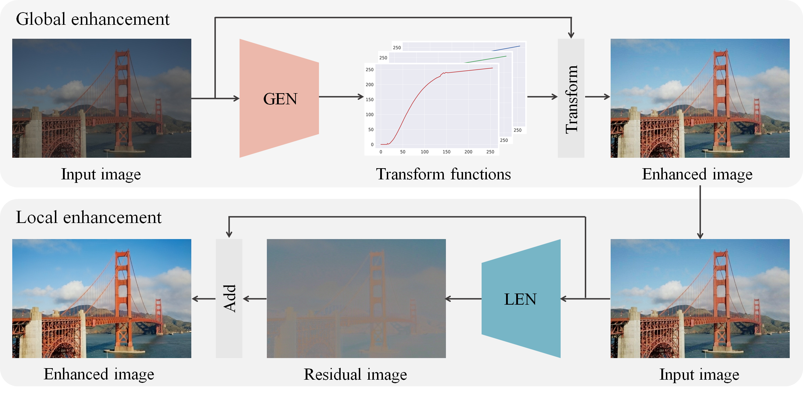

This is a deatiled file tracks works on low light & contrast enhancement by time. All the papers and codes will be collected here.
[comment]:<> (Anchor for Back to top)

# low-light

## 2020

### November
- Gilroy S P, O’Dwyer J, Bortoleto L C. **Characterisation of CMOS Image Sensor Performance in Low Light Automotive Applications**
    - [[arxiv:2011.12436]](https://arxiv.org/abs/2011.12436)

- Guo C, Li C, Guo J, et al. **Zero-Reference Deep Curve Estimation for Low-Light Image Enhancement[C]** Proceedings of the IEEE/CVF Conference on Computer Vision and Pattern Recognition. 2020: 1780-1789.(CVPR2020) 
    - [[PyTorch code]](https://github.com/Li-Chongyi/Zero-DCE)

### Date Before November

- Kim H U, Koh Y J, Kim C S. **Global and Local Enhancement Networks for Paired and Unpaired Image Enhancement[C]** European Conference on Computer Vision. Springer, Cham, 2020: 339-354.
    - [[Project page]](http://mcl.korea.ac.kr/research/hukim-eccv2020-glenet/) [[PDF]](http://mcl.korea.ac.kr/research/hukim-eccv2020-glenet/5010.pdf)
    

- Chan S H. Dynamic Low-light Imaging with Quanta Image Sensors[J]. 2020.
    - [[PDF]](https://engineering.purdue.edu/ChanGroup/project_QIS.html) [[Quanta Image Sensor project page]](https://engineering.purdue.edu/ChanGroup/project_QIS.html)
    - 量子成像去噪，跟自然图像其实不是很相关

- Kwon D, Kim G, Kwon J. DALE: Dark Region-Aware Low-light Image Enhancement[J]. arXiv preprint arXiv:2008.12493, 2020.
    - [Github](https://github.com/dokyeongK/DALE) with no code release.
    - <a href="#idlow-lightgan">`low-lightgan`</a>

- Kosugi S, Yamasaki T. **Unpaired image enhancement featuring reinforcement-learning-controlled image editing software[C]** **Proceedings of the AAAI Conference on Artificial Intelligence. 2020, 34(07): 11296-11303.
    - [[PDF]](https://arxiv.org/pdf/1912.07833.pdf) [[Python code]](https://github.com/satoshi-kosugi/Unpaired-Image-Enhancement) based on [chainer_spiral](https://github.com/DwangoMediaVillage/chainer_spiral)

## 2019

- Ren, Wenqi, et al. **"Low-light image enhancement via a deep hybrid network."** IEEE Transactions on Image Processing 28.9 (2019): 4364-4375.
    - [[PDF]](https://ieeexplore.ieee.org/document/8692732) [[Caffe code]](https://drive.google.com/drive/folders/1Tx6x6m8dkU0HG8h3a02_TiGbGGIh6s8Y)
> weighted spatially variant RNN
> 
> 文章的网络分成两部分：content stream和edge stream，作者的解释是content 那部分使用的encoder-decoder网络处理时丢失了低光照图像的一些结构细节信息。加入的edge stream弥补这个问题，使用spatially variant RNN，其权重引导由另外的encoder-decoder产生。
> 
> PS：RNN使用在图像恢复中是16年的ECCV：learning recursive filters for low-level vision via a hybrid neural network。他们的是normalized RNN：
> 
> $$ h\left [{ k}\right] = \left ({1-p\left [{k}\right]}\right) \circ x\left [{ k}\right] + p\left [{k}\right] \circ h\left [{ k-1}\right]$$
> h是状态， x是k处像素，p是权重。低亮度的图像不能直接用，没有效果。因为它有归一化的存在，不能对不同的图片作出不同的响应，不能区分亮暗图像存在的整体亮度的差别。
> 
> 文章的改进：
> $$h\left [{ k}\right] = g\left [{k}\right] \circ x\left [{ k}\right] + p\left [{k}\right] \circ h\left [{ k-1}\right]$$
> 其中，g是与p互相独立的weight map。这样$h[k]$和$h[k-1]$可以互相独立，这取决于$p[k]$:小的时候$h[k]$和$h[k-1]$关系不大，可以保边；反之，若是p大，可以继续保持平滑。psnr平均提升不到1个点

- Zhang, Yonghua, Jiawan Zhang, and Xiaojie Guo. **"Kindling the darkness: A practical low-light image enhancer."** Proceedings of the 27th ACM International Conference on Multimedia. 2019.
    - [[Tensorflow code]](https://github.com/zhangyhuaee/KinD) [pdf](https://arxiv.org/pdf/1905.04161.pdf)

- Wang, Ruixing, et al. **"Underexposed photo enhancement using deep illumination estimation."** Proceedings of the IEEE Conference on Computer Vision and Pattern Recognition. 2019.
    - [[Tensorflow code]](https://github.com/wangruixing/DeepUPE)

- Wang, Yang, et al. **"Progressive Retinex: Mutually Reinforced Illumination-Noise Perception Network for Low-Light Image Enhancement."** Proceedings of the 27th ACM International Conference on Multimedia. 2019.
    - [pdf](https://arxiv.org/pdf/1911.11323.pdf)
    - [slides(non-official)](http://39.96.165.147/Seminar/MinhaoFan_200308.pdf)

> 文章强调了：图像暗部的噪声与亮度是有相关性的，越暗噪声越多。
> 
> 内容亮点：
> 
> - illumination and noise of low-light image are perceived in a ==mutual reinforced manner==
> - two fully pointwise convolutional neural networks to model the statistical regularities of ambient light and image noise respectively
> 
> lowlight模型：
> $$\min _{\ell, r, \ell \geq s}\left\{\lambda_{\ell}\|\ell-s\|_{2}^{2}+\rho(\ell)\right\}+\alpha\left\{\lambda_{r}\|r-s+\ell\|_{2}^{2}+\rho(r)\right\}$$
> 可以分解为亮度和噪声等级估计两个任务：
> $$\min _{\ell: \ell \geq s}\left\{\lambda_{\ell}\|\ell-s\|_{2}^{2}+\rho(\ell)\right\}$$
> 
> $$\min _{r: \ell \geq s} \alpha\left\{\lambda_{r}\|r-s+\ell\|_{2}^{2}+\rho(r)\right.$$
> 
> 其中$s$是低光照图像，$\ell$,$r$来自retinex模型：$s=\ell\circ r $
> 
> $\rho(·)$是个二次的正则化项。
> 
> 网络分为两部分，亮度的和噪声的估计，他们是互相依赖的
> 
> - IM-Net : estimate the illumination for a given low-light patch
> 
> - NM-Net : estimate the noise variance for a given low-light patch
> 
> Progressive Mechanism：联系网络的两个部分，找到噪声与亮度的关系。
> 
> Loss：MSE
- Wang, Junyi, et al. **"RDGAN: Retinex decomposition based adversarial learning for low-light enhancement."** 2019 IEEE International Conference on Multimedia and Expo (ICME). IEEE, 2019.
    - [[Tensorflow code]](https://github.com/WangJY06/RDGAN)

- Kim, Guisik, Dokyeong Kwon, and Junseok Kwon. **"Low-lightgan: Low-light enhancement via advanced generative adversarial network with task-driven training."** 2019 IEEE International Conference on Image Processing (ICIP). IEEE, 2019.
    - Same [group](http://cau.ac.kr/~jskwon/) with <a href="#idDALE">`DALE`</a> which is the latest work based on Low-lightgan and accepted in BMVC2020.

> 有什么亮点？
>
> a task- driven training set是个与众不同的点，作者指出之前的增强都是把整张图片的亮度一起提高，没考虑到实际情况光源复杂，不是整体都用的同一个光源照明，所以并非均匀，他把整个图片切割成不同的块，并为他们分级，从0.1到1，1代表不需要认为增加亮度的部分，0.1代表很需要。

- Malik, Sameer, and Rajiv Soundararajan. **"Llrnet: A multiscale subband learning approach for low light image restoration."** 2019 IEEE International Conference on Image Processing (ICIP). IEEE, 2019.

 
- Lv, Feifan, and Feng Lu. **"Attention-guided low-light image enhancement."** arXiv preprint arXiv:1908.00682 (2019).
    - [[Project page]](http://phi-ai.org/project/AgLLNet/default.htm) with no code release.

- Jiang Y, Gong X, Liu D, et al. **Enlightengan: Deep light enhancement without paired supervision[J].** arXiv preprint arXiv:1906.06972, 2019.
    - [[Pytorch code]](https://github.com/TAMU-VITA/EnlightenGAN)

- Maharjan P, Li L, Li Z, et al. **Improving extreme low-light image denoising via residual learning[C]** 2019 IEEE International Conference on Multimedia and Expo (ICME). IEEE, 2019: 916-921.
    - [[PDF]](http://chongyangma.com/publications/ie/2019_ie_preprint.pdf)
    - 去噪

## 2018

- Wei, Chen, et al. **"Deep retinex decomposition for low-light enhancement." BMVC. 2018.**
    - [[Project page]](https://daooshee.github.io/BMVC2018website/) [[Tensorflow code]](https://github.com/weichen582/RetinexNet) [[Dataset]](https://daooshee.github.io/BMVC2018website/) 
- Wang, Wenjing, et al. **"GLADNet: Low-light enhancement network with global awareness."** 2018 13th IEEE International Conference on Automatic Face & Gesture Recognition (FG 2018). IEEE, 2018.
    - [[Project page]](https://daooshee.github.io/fgworkshop18Gladnet/) [[Tensorflow code]](https://github.com/weichen582/GLADNet)[[Dataset]](https://daooshee.github.io/fgworkshop18Gladnet/)
- Lv, Feifan, et al. **"MBLLEN: Low-Light Image/Video Enhancement Using CNNs."** BMVC. 2018.
    - [[Project page]](http://phi-ai.org/project/MBLLEN/default.htm) [[Tensorflow code]](https://github.com/Lvfeifan/MBLLEN)
> 主要内容：
> 
> - 提取卷积网络每层的特征进行融合
> - 可以改为视频的增强
> 
> 网络三部分：
> 
> - the feature extraction module (FEM)
> - the enhancement module (EM) 
> - the fusion module (FM)
> 
> 改为视频的：FEM变成3D卷积
- Chen, Chen, et al. **"Learning to see in the dark."** Proceedings of the IEEE Conference on Computer Vision and Pattern Recognition. 2018.
    - [[Project page]](https://cchen156.github.io/SID.html) [[Tensorflow code]](https://github.com/cchen156/Learning-to-See-in-the-Dark) [[Dataset]](https://github.com/cchen156/Learning-to-See-in-the-Dark)
- Chen, Yu-Sheng, et al. **"Deep photo enhancer: Unpaired learning for image enhancement from photographs with gans."** Proceedings of the IEEE Conference on Computer Vision and Pattern Recognition. 2018. (spotlight)
    - [[Github]](https://github.com/nothinglo/Deep-Photo-Enhancer) [[PDF]](https://www.csie.ntu.edu.tw/~cyy/publications/papers/Chen2018DPE.pdf) [[project]](http://www.cmlab.csie.ntu.edu.tw/project/Deep-Photo-Enhancer/)
> Unpair增强,不是low-light的
>
> 内容亮点：
> 
> 1. ==对U-net进行修改，增加提取全局特征进行学习==
> 2. 对WGAN进行改进，可以自动调整其权重系数
> 3. 在生成器中添加可以学习特定风格的individual BN层

- Ignatov A, Kobyshev N, Timofte R, et al. **WESPE: weakly supervised photo enhancer for digital cameras[C]** Proceedings of the IEEE Conference on Computer Vision and Pattern Recognition Workshops. 2018: 691-700. 
    - [[project]](http://people.ee.ethz.ch/~ihnatova/wespe.html)

- Cai J, Gu S, Zhang L. Learning a deep single image contrast enhancer from multi-exposure images[J]. IEEE Transactions on Image Processing, 2018, 27(4): 2049-2062.
    - [[PDF]](http://www4.comp.polyu.edu.hk/~cslzhang/paper/SICE.pdf) [[Caffe code]](https://github.com/csjcai/SICE) [[SICE Dataset]](https://github.com/csjcai/SICE)

## 2017

- Guo X, Li Y, Ling H. **LIME: Low-light image enhancement via illumination map estimation[J]**. IEEE Transactions on image processing, 2016, 26(2): 982-993.  TIP 2017 / ACM MM 2016
    - [[Project page]](https://sites.google.com/view/xjguo/lime) [[MATLAB code]](https://drive.google.com/open?id=0BwVzAzXoqrSXb3prWUV1YzBjZzg) [[Dataset]](https://drive.google.com/open?id=0BwVzAzXoqrSXb3prWUV1YzBjZzg) [[PDF]](https://www3.cs.stonybrook.edu/~hling/publication/LIME-tip.pdf)

- A New Low-Light Image Enhancement Algorithm using Camera Response Model 
    - [[PDF]](https://openaccess.thecvf.com/content_ICCV_2017_workshops/papers/w43/Ying_A_New_Low-Light_ICCV_2017_paper.pdf)

- Ying Z, Li G, Ren Y, et al. **A new image contrast enhancement algorithm using exposure fusion framework**[C] International Conference on Computer Analysis of Images and Patterns. Springer, Cham, 2017: 36-46.
    - [Project]](https://baidut.github.io/2017/08/22/caip2017fuse2/) [[Matlab code]](https://baidut.github.io/2017/08/22/caip2017fuse2/)

## 2016 and before
- Fu X, Zeng D, Huang Y, et al. **A fusion-based enhancing method for weakly illuminated images**[J]. Signal Processing, 2016, 129: 82-96.
    - [[Project page]](https://xueyangfu.github.io/projects/sp2016.html) [[PDF]](https://xueyangfu.github.io/paper/2016/SP/SP2016.pdf) [[Matlab code]](https://xueyangfu.github.io/paper/2016/SP/Matlab_code.zip)
    - [Xueyang Fu (傅雪阳)](https://xueyangfu.github.io/)

- Fu X, Zeng D, Huang Y, et al. **A weighted variational model for simultaneous reflectance and illumination estimation**[C] Proceedings of the IEEE Conference on Computer Vision and Pattern Recognition. 2016: 2782-2790.
    - [[PDF]](https://xueyangfu.github.io/paper/2016/cvpr/cvpr2016.pdf) [[Matlab code]](https://xueyangfu.github.io/paper/2016/cvpr/Matlab_implementation.zip)
    - [Xueyang Fu (傅雪阳)](https://xueyangfu.github.io/)

- Wang S, Zheng J, Hu H M, et al. **Naturalness preserved enhancement algorithm for non-uniform illumination images**[J]. IEEE Transactions on Image Processing, 2013, 22(9): 3538-3548. 
    - [[Project page]](http://blog.sina.com.cn/s/blog_a0a06f190101cvon.html) [[Matlab code]](https://s/096l3uy9vowgs4r/Code.rar) [[NPE dataset]](http://s/39gjz7oe1a0rlhk/original%20images%20in%20the%20paper.rar)

<a href="#head">`Back To TOP`</a>
